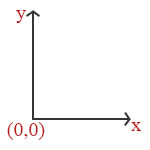

# Draw Images #

You have seen the basic structure of a *libGDX* game, I can feel that you are now ready to add images to enhance your games! :smiley:

## Import an Image ##
Before using an image, we should add it to our assets folder.
In this repository, I decided to keep the *android/assets* folder, as I always did for my project. You could use anything you want, but remember to add the folder in the configuration.

For learning purposes, I decided to use this image for this section:
<p align="center">
    
</p>

## Coordinates System ##
Before diving into the drawing, we should talk about the coordinate system, and especially the one in *libGDX*.
All you have to remember is that the *libGDX* coordinate system is defined by the bottom left corner.
In other words:
<p align="center">
    
</p>
To sum up, the point of coordinates (0,0) is located at the bottom left corner, the (screenWidth, 0) is located at the bottom right corner, and the (0, screenHeight) is located at the top left corner.

## Display a Texture object ##
In order for the tutorial to be cleared, we are going to code in a small class called *Chapter1*, following the framework pattern, a `create()` and a `render()` function, called in the *Main* class.

the *Texture* class has several constructors you can use according to what you need.
I will not show you every constructors, but only the most used.
It is time to display our Github logo!
######Go in the Chapter1.java file et let's declare our *Texture*:######
```java
private Texture logoTexture_;
```
Now, it is time to load it in the `create()` method:
```java
@Override
public void create () {
    ...
    logoTexture_ = new Texture("chapter-1/github-logo.png");
}
```
Let's now draw our beautiful image:
```java
batch_.draw(logoTexture_, 0, 0);
```

Finally, change your *Main* class to call the *Chapter1* class code:
```java
public class Main extends ApplicationAdapter {
	private SpriteBatch batch_;

    private Chapter1 chapter1_;

	@Override
	public void create () {
		batch_ = new SpriteBatch();
		chapter1_ = new Chapter1();
        chapter1_.create();
	}

    @Override
	public void render () {
		Gdx.gl.glClearColor(1, 0, 0, 1);
		Gdx.gl.glClear(GL20.GL_COLOR_BUFFER_BIT);
		batch_.begin();
		chapter1_.render(batch_); // Draw the full chapter1 example
		batch_.end();
	}
}
```


###### TADA! this is the result ######
/ show image here /

This is what you should see, and I agree, the whole screen is a bit red!

:information_source: Whenever you want, you can try your test on *Android*, *iOS*, or *HTML*. You are free to test on every platforms. I will most likely test on Desktop for practical reasons.

:exclamation: Be careful while using *SpriteBatch*, and the methods `begin()` and `end()`. They are quite heavy, you should not call them for every texture you draw, but rather call them once and draw everything between both methods. If you take a look at the *Chapter1* class, the `render()` method is given a reference to the *SpriteBatch* in order to avoid instanciating a new one and calling again `being()` and `end()`

###### Some useful methods belonging to the *Texture* class ######
* `getWidth()`: Returns the width of the *Texture*
* `getHeight()`: Returns the height of the *Texture*
* `dispose()`: Disposes(free the memory space) associated to the texture *Texture*

Try to change a bit the coordinates, to see how the drawing works.
Think about taking a look at the batch, to scale the texture, etc... but do not worry, we will see everything accross this tutorial :smiley:

## Display a Sprite object ##
There is a difference between a *Texture* and a *Sprite*. A *Sprite* contains a *Texture* with other attributes: a position, a rotation angle, a scale, etc...
Usually, we use a *Texture* to render something static, and a *Sprite* for movalbe entities, animations, ...

Let's now display our github logo using a *Sprite*.

The *Sprite* instanciation:
```java
public void create () {
       logoTexture_ = new Texture("chapter-1/github-logo.png");
       logoSprite_ = new Sprite(logoTexture_);
   }
```
As you can see, there is a constructor overload taking a *Texture* as parameter. I decided to reuse our *Texture*, but you could directly have instanciated one in the constructor.

Let's see the `render()` method:
```java
public void render(SpriteBatch batch) {
    logoSprite_.draw(batch);
}
```
If you take a look at the body of the *Sprite*.`draw()` function (by going to the definition with your IDE), you will actually understand what it does. The function simply calls the `draw()` function from the *SpriteBatch* object, giving it the attributes of the *Sprite* (the position, rotation, etc...).

###### and now... TADA! this is the result ######
/ show image here /

It should actually be the same!
Now that you know how to draw a *Sprite*, let's get deeper to find new cool features!
Go to the `create()` function in the *Chapter1* class, and add the following code after the *Sprite* instanciation:
```java
public void create () {
        ...
       logoSprite_.setPosition(Gdx.graphics.getWidth() / 2, Gdx.graphics.getHeight() / 2);
   }
```

And this is the result if you did not change the resolution of your window:

/ show image here /
What does the code here, is simply to set the position of the *Sprite* through the `setPosition()` method. Here, we are setting the position at the center of the screen, using the *Gdx* class, containing static methods to access the *Application*, *Graphics*, etc.. it basically allows you to access some data, such as the width/height of the screen, get the number of frame per seconds, etc...
Here, we access the screen dimensiosn through the getters `Gdx.graphics.getWidth()` and `Gdx.graphics.getHeight()`.

###### Ok, the *Sprite* moved, but why is it actually not centered :grey_question: ######

This is a consequence of the drawing origin. Remember the previous coordinate system drawing, we said that *libGDX* is drawing from the bottom left corner, that why the image appear to be on the top right of the screen, because its bottom left point is at the center of the screen.
/ show image here /

*libGDX* thought about us! :smiley:
You can just use the `setOrigin()` method, allowing a sprite to know what is the origin of drawing.

For instance, we can fix the drawing position of our logo by doing this in the `create()` method:
```java
public void create () {
    ...
    logoSprite_.setOrigin(logoSprite_.getWidth() / 2, logoSprite_.getHeight() / 2);
}
```
Sadly, you actually see that this does not work...

:exclamation: *libGDX* does not take the origin into account when drawing at a positon, but only for the **rotation** and the **scale**.

Consequently, we have to do it by hand, by subtracting half of the width and half of the height to the position:
```java
public void create () {
    ...
    // Modify the setPosition like that
    // You can either use the getOrigin as I did (because we previously set it)
    // or subtract half of the width and half of the height
    logoSprite_.setPosition(Gdx.graphics.getWidth() / 2 - logoSprite_.getOriginX(),
                            Gdx.graphics.getHeight() / 2 - logoSprite_.getOriginY());
}
```

And now you shoud obtain the proper result :smiley:
