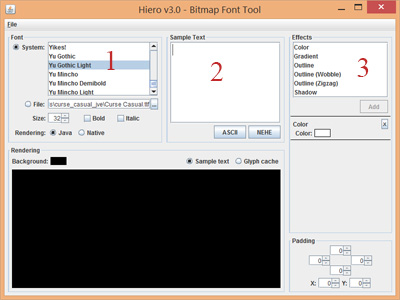
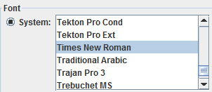
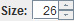
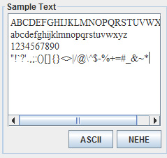

# Display Some Text #

In this section, you will learn how to display simple text with *libGDX*.

## Bitmap fonts ##

*libGDX* can handle only one type of font: **Bitmap Font**.
For those who do not know what it actually is, **Bitmap Font** is a format containing characters in a png file.
As opposed, you can come across the **Outline Font** or **Vector Font**. These fonts are not composed by a pixel array (an image), but simply by using bezier curves and instructions to describe the shape of the glyph. The advantage compared to the **Bitmap Font** is the size, you can scale **Vector Font** as much as you like, as it is not rasterized, you will never see the pixels or an **aliasing effect**. However, it needs more computing to be render and so, they appear to be less efficient than the first type.

### Create you own Bitmap Fonts ###

The *libGDX* tool allowing us to create our own **Bitmap Font** is called *Hiero* and is located in the **tools/** folder.
You can also download it from the official [*libGDX* website.](https://libgdx.badlogicgames.com/tools.html)

First, let's launch the *hiero.jar* file, you can either do it by double clicking on it (only if you are on *Windows*), or by using the **java** command with the **jar** option:

`java -jar hiero.jar`

You should obtain something like that:

    

1. This window allows you to select the font you want to use.
2. You should write here all the characters that you need. If you forget some of them, you will not be able to display them in your game.
3. Add small effect, such as shadows, text coloring...

#### Let's try to create the most beautiful font ####

* First, choose the **Times New Roman**

    

* After that, just below, choose the size of the police you want. For this tutorial, I will enter **26**.

    

* Normally, some characters already appeared by themselves in the **Sample Text** window. Let every character you want and delete the other (you can keep everything).
* You can click below, on **ASCII** or **NEHE**. **NEHE** makes some **Unicode** characters show.

    

* Finally, click on **File->Save BMFont file (text)** and choose where you want to save it (it is a good idea to save it in our *assets/* folder).

    
    

## Draw Text with libGDX ##
