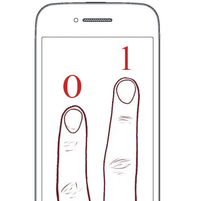

# Keys Handling (Part 2/2) #

## Touch Screen ##

#### Checks if the screen is touched ####
Whenever someone creates a smartphone game, he may wants it to detect touch inputs, that's actually better to play when there are no buttons (ok, it is possible to create an accelerometer-only game).

Just as for the **mouse**, you can use a simple check:

* `Gdx.input.isTouched()`

This function will return **true** if the screen is touched, and **false** otherwise.
Simple, isn't it?
Where are not seing anything new here, and that is exactly what is making you stronger. :fist:

We can even go further, using a useful overload:

* `Gdx.input.isTouched(index)`

It basically indicates wehther the selected finger is touching the screen or not.

Take a look at the following image:

<p align="center">
    
</p>

The first finger to touch the screen was the left one, it has been attributed the smallest index, this is why it contains the **0** value.
The second one that has been put on the screen is the right one, this is why it has the **1** value (the following index).

```
Be careful here, indexes are attributed according to the fingers that are already touching the screen.
Whenever a finger is raised, its indexed is released. The indexing is made such that the following finger touching the screen is going to be assigned the smallest free index.
```

Look at this small example:
* I put my first finger on the screen. It has now **index 0**.
* I put a second finger (without raising up the first one). It has now **index 1**
* I raise up the first finger, **index 0** is free.
* I put another finger (let's say the third one), it is attributed **index 0**.

#### Checks if the screen is quickly touched ####

To check if the screen has been touch quicly (during a small amount of time), you can use the following method:

* `Gdx.input.justTouched()`

You can use it just like every other **method** I showed you above.

#### Touch position ####

In order to obtain the **x** and **y** value associated to the screen touch, you will use the following getters:

* `Gdx.input.getX()` and `Gdx.input.getY()`

Here, nothing is new for you, it is exactly the same as the **mouse** position.

But you can go even further, knowing the position of a special index:

* `Gdx.input.getX(index)` and `Gdx.input.getY(index)`

This overload allows you to focus only on a special finger index.

```
Be careful here, when using the getX() and getY() methods without the index parameter, it takes the 0 index for the position.
```

## Going Further With The Accelerometer ##

*libGDX* offers you a **wrapper** arround the device **Accelerometer**.

The accelerometer axis are oriented as follows on **Android**:

<p align="center">
    
</p>

You can use these useful methods to handle the accelerometer:

* `Gdx.input.getAccelerometerX()`
* `Gdx.input.getAccelerometerY()`
* `Gdx.input.getAccelerometerZ()`

Giving you the acceleration on the 3 axis.

## Going Further With The Gyroscope ##

The **accelerometer** is a good way to add gameplay features to you games. However, sometimes, you just want to know how the device is oriented, according to the coordinates system defined by the phone (on the above drawing). In order to do this, you have to use the **gyroscope.**

In order to use this sensor, you first have to activate it through this command:

```java
config = new AndroidApplicationConfiguration();
config.useGyroscope = true;
```

```
Actually, whenever you need to switch off/on a sensor, you can just get back the ApplicationConfiguration from the target you want, and switch on/off the boolean corresponding to the sensor you want to modify.
```

What you should know is that every **Android** may not possess a **gyroscope**, that's why you have to check, before trying to using it, if it exists:

* `Gdx.input.isPeripheralAvailable(Peripheral.Gyroscope);`

What basically does the `Gdx.input.isPeripheralAvailable()` is to check whether a given peripheral can be accessed on the device currently running your code. It shall be used with the *Peripheral* static **enum**, containing basic attributes (**gyroscope**, **compass**, etc...).

Being sure the returned **boolean** is **true**, you can use the following methods:

* `Gdx.input.getGyroscopeX()`
* `Gdx.input.getGyroscopeY()`
* `Gdx.input.getGyroscopeZ()`

Giving you the rate of rotation arround each axis (in **rad/s**)

## Other Sensors ##

I will not list you every existing sensors (some devices can have a bunch of them!), you can follow [this link](https://github.com/libgdx/libgdx/wiki/Input-handling), and on the right side, choosing the sensor you want to know about.
The method to use them is often the same, using the **configuration** to activate it, and check whether it is on the device or not.

<p>
    <a href="4-keys-handling-1.md">
        
    </a>
    <a href="5-sound.md">
        
    </a>
</p>
