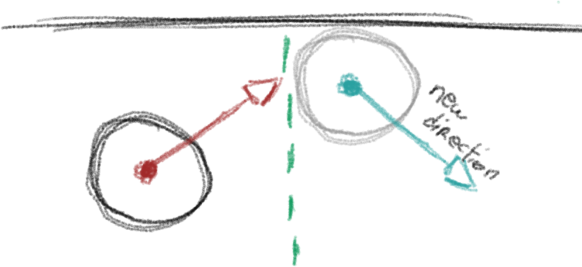
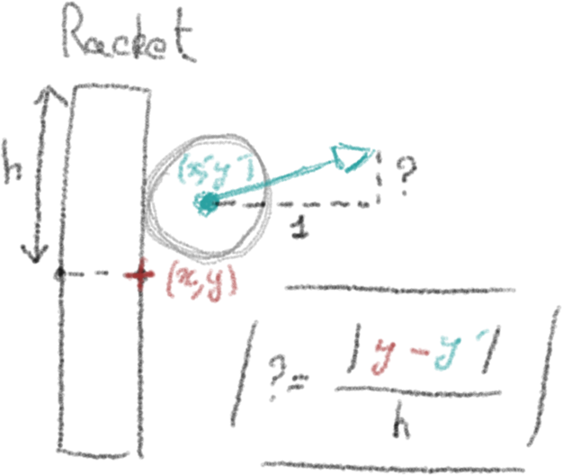
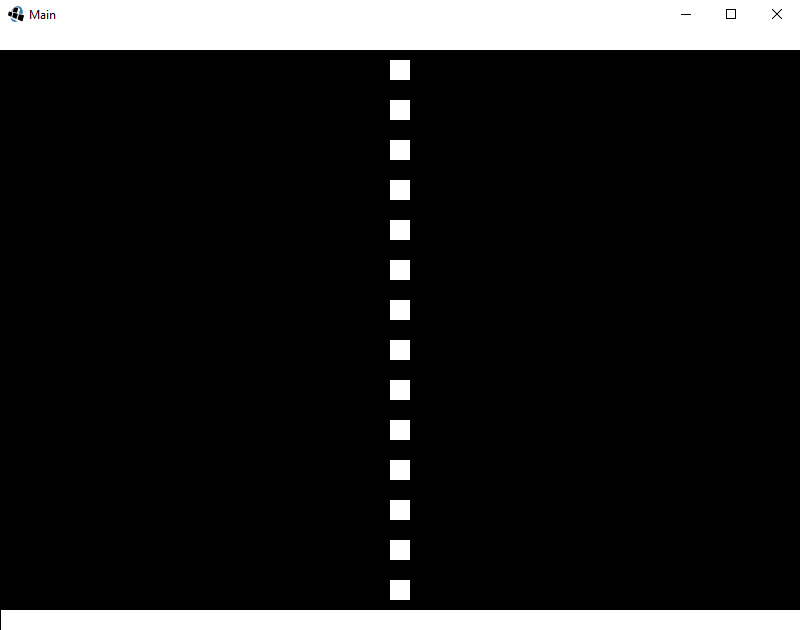
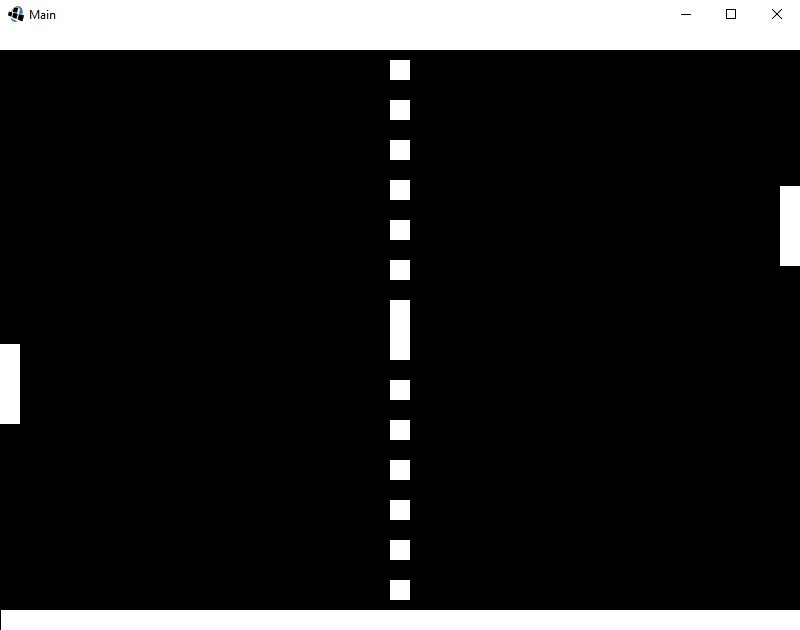

# Practical Work : (Ping) Pong! #

Welcome to this Practical session, through which you are going to create your first pong! (at least with *libGDX*).

Until now, we did not try to make the game run on **Android** (maybe you did it), because we did not really see how to handle several resolution.

Next chapter will be very detailled regarding multiresolutions, cameras, viewports, etc...

So, for this practical session, we are going to follow these "rules":

* The game will be designed for desktop for learning purposes. All the given images are made to run on a **x** resolution. You can try it on your **Android**/**iOS** device but with large black bands.
* Do not be afraid to modify it as you want, modifying/adding every single features you want.
* Even if the game can be create only using shapes (*libGDX* has a good API to draw procedural shapes),
we are going to use **Sprites**, in order for you to use them a bit. But obviously, pong is a game that can easily be created without sprites, using only rectangles.
Using images brings also other difficulties, as we can not resize them easily, unlike shapes that can easily be modified using a bit of maths.

## A Bit Of Design ##

There are plenty of architectures games can be based on, some are very good, some
are very bad. Depending on the game type (cards game, RPG), the game architecture
will be submitted to a lot of change.
Here, as it is our first practical work and as the game is pretty simple, we are not going to make a huge OOP modelisation.
I chose to split the game like this:
* A **Ball** class, used as a *Model*, containing the ball data and how it should be updated
* A **Racket** class, working as the **Ball** class.
* A **PongScreen** class, containing the game logic (rackets, ball, scores, ...)
* And just for simplicity, we will add a **Const** class in order to avoid hardcoding some useful values (move speed, etc...). It will allows us to easily change settings without going through each class.

## A Bit Of Maths ##
In our **Pong** game, we are going to use pretty basic maths. You can use something better for the physics, but I wanted to keep it simple. You could use a lot of things, like vector reflection, acceleration, etc... But this is not the point here.

#### The Ball ####

##### Terrain collisions #####

<p align="center">
    
</p>

As you can see on the above drawing, terrain collisions are going to be simply handled by keeping the same *x* direction and getting the **opposite** value of the *y* coordinate.
We are going to store the direction as a 2D vector.
For those who don't know what is vector is, you should **Google** it in order to know some basic maths. If you are here, I think that there is a lot of chance you know what a vector is, but anyway, it is better for the others to understand it.

In pseudocode, we will obtain something like:
```
direction = (oldDirection.x, - oldDirection.y);
```

##### Racket collisions #####

We want to find the new **direction** after the ball collision with a racket:

* For the *x* component, we will look at the racket that collides. If it is the left one, the *x* component will simply have **1**, because the ball will move toward the right part.
If it is the right one, it will be **-1**, because the ball will move toward the left.
* For the *y* component, I decided to use something that has given good results for me.
We will give the *y* component a value between **-1** and **1**, according to the length between the *y* component of the ball and the center of the racket. If the ball is centered on the racket, it will have a **0** value and go straight forward. If it is close to the top extremity of the racket, it will go at arround **45° North**, otherwise, if it is close to the bottom extremity, it will go at arround **45° South**

Below a little drawing explaning all this strange description:

<p align="center">
    
</p>

As you can see, the closer the ball is to the middle of the racket, the straighter it is going to move. However, when it collides with the top of the racket, the direction will be close to **(1, 1)**, meaning the vector is going to be oriented North-East.
For the bottom part of the racket, we will keep the same formula, and just take the **opposite** of the *y* component, in order to point toward the South.

All the *"formulas"* I am introducing here are not special formulas for this game, if you look on the internet, you may find very different explanations. I just thought it was simple to implement, and it could make the game fun to be played.
If you have better idea to improve the **physics**, do not hesitate to implement them.

## Let's Code ##

#### Basic screen setup ####

The **PongScreen** class will be used as a **Screen**/**State**, containing our game logic. It will be the major part of the program, linking everything together.
I chose to follow a basic template, our **Screen** will have two major methods: `update()` and `render()`

###### PongScreen.java #######
```java
public class PongScreen {

    public PongScreen() { }

    public void update() { }

    public void render(SpriteBatch batch) { }
```

We will add our basic background to this class, displayed as **Texture** (a **Sprite** does not make sense here).

Let's first create the attribute, and instantiate it in the constructor:

###### PongScreen.java #######
```java
public PongScreen() {
       // Instantiates the background
       terrainTexture_ = new Texture("pong/terrain.png");
}
...
public void render(SpriteBatch batch) {
    // Draws the background
    batch.draw(terrainTexture_, 0, 0);
}
```

The background has been made for the specified resolution: **800*600**.
So, you do not have anything to do, it will fit by default, except if you try to run the game on a different resolution.
You should see something like that:

<p align="center">
    
</p>

For now, it should basically looks like that.
I chose to do it like that in order to really split the **Pong** code of the exercises from previous/next chapters. You can directly use the **Main** class if you prefer, instead of going through the **PongScreen** one that is not mandatory.
Anyway, if you use this class, do not forget to call it in the **Main** class, which is the entry point of our game.

###### Main.java #######
```java
public class Main extends ApplicationAdapter {
	private SpriteBatch batch_;
	private PongScreen  pongScreen_;

	@Override
	public void create () {
		batch_ = new SpriteBatch();
        // Instantiates it
		pongScreen_ = new PongScreen();
	}

	@Override
	public void dispose() {
		super.dispose();
	}

	@Override
	public void render () {
		Gdx.gl.glClearColor(0, 0, 0, 1);
		Gdx.gl.glClear(GL20.GL_COLOR_BUFFER_BIT);

		// Updates the scene
		pongScreen_.update();
		// Draws the scene
		batch_.begin();
		pongScreen_.render(batch_);
		batch_.end();
	}
}
```

Ok, now that our base is setup, we can begin to create our models, the ball and the racket.

#### The different entities ####

All our drawable entities will have a composition with **Sprite**. This object-modeling is not mandatory and is not the best model for all games. Here, the game is pretty simple and quick to code, we can keep it like this.

##### The Ball #####

So, the ball will be designed like this:
* It will have a **Sprite** attribute and a **Vector2** representing the moving direction.
* A constructor initializing both attributes.
* An `init()` method randomizing the initial direction and moving the ball at the desired initial position.
* A `setDirection()` method to change the moving direction whenever the ball collides.

###### Ball.java #######
```java
public class Ball {

    private Sprite  sprite_;
    private Vector2 direction_;

    public Ball(int x, int y) {
        sprite_ = new Sprite(new Texture("pong/ball.png"));
        init(x, y);
    }

    public void update(float deltaTime) {
        sprite_.translate(direction_.x * Const.BALL_SPEED * deltaTime,
                          direction_.y * Const.BALL_SPEED * deltaTime);
    }

    public void init(int x, int y) {
        sprite_.setPosition(x, y);
        if (2 * (float)Math.random() - 1.0f <= 0.0f)
            setDirection(new Vector2(-1.0f, 0.0f));
        else
            setDirection(new Vector2(1.0f, 0.0f));
    }

    public void setDirection(Vector2 direction) {
        direction.nor();
        direction_ = direction;
    }

    public Vector2 getDirection() {
        return direction_;
    }

    public Sprite getSprite() {
        return sprite_;
    }
```

The constructor is pretty simple, it instanciates the **Sprite** by using a **Texture** and the path toward the ball image. It also calls the `init()` method, which generates a random number, positive or negative, used to choose whether the ball should go toward the left or the right part of the screen.

```java
...
public void update(float deltaTime) {
    sprite_.translate(direction_.x * Const.BALL_SPEED * deltaTime,
                      direction_.y * Const.BALL_SPEED * deltaTime);
}
...
```

The update method simply move the sprite according to the direction, the chosen speed and the **deltaTime** used for time independance.

:information_source: The `translate()` method from the **Sprite** class allows to translate, that is to say moving it with a certain amount from it's current position.

Finally, the `setDirection()` method:
```java
public void setDirection(Vector2 direction) {
    direction.nor();
    direction_ = direction;
}
```
A simple setter, **normalizing** the given direction in order to be sure to keep a vector representing a direction, with a unitary magnitude.

##### The Racket #####

The racket is going to be designed like this:
* The constructor will work the same.
* There will be 2 methods: `moveUp()` and `moveDown()` Used to move the racket up
and down while checking that it is not going out of the screen.
* An init() method working the same way as previously.

###### Racket.java #######
```java
public class Racket {

    private int     initX_;
    private int     initY_;

    private Sprite  sprite_;

    public Racket(int x, int y) {
        sprite_ = new Sprite(new Texture("pong/racket.png"));

        initX_ = x;
        initY_ = y;

        init();
    }

    public void moveUp(float deltaTime) {
        if (sprite_.getY() + sprite_.getHeight() < 580)
            sprite_.translateY(Const.RACKET_SPEED * deltaTime);
    }

    public void moveDown(float deltaTime) {
        if (sprite_.getY() > 20)
            sprite_.translateY(- Const.RACKET_SPEED * deltaTime);
    }

    public void init() {
        sprite_.setPosition(initX_, initY_ - sprite_.getHeight() / 2);
    }

    public Sprite getSprite() {
        return sprite_;
    }
}

```

Moving the racket up:

###### Racket.java #######
```java
public void moveUp(float deltaTime) {
    if (sprite_.getY() + sprite_.getHeight() < 580)
        sprite_.translateY(Const.RACKET_SPEED * deltaTime);
}
```
The code is pretty basic, we move the racket up only if it has not reached the top of the screen. As it moves only upside down, we only translate it on the *y* coordinate, by a given amount and the **delaTime** for time independance.

#### Grouping things together ####

Now that we have the **Racket** and the **Ball** class, we are going to put them in the **PongScreen** class to begin to code the gameplay.
We will begin by adding two rackets, controlled by polling keys/mouse, using the input you want.

We will now init the two rackets, the ball, and update the rackets by getting inputs from two different player (or the same one if you like to play alone).

###### PongScreen.java #######
```java
public class PongScreen {

    private Texture     terrainTexture_;

    private Racket      racketLeft_;
    private Racket      racketRight_;
    private Ball        ball_;

    public PongScreen() {
        ...
        racketLeft_ = new Racket(0, 300);
        racketRight_ = new Racket(780, 300);

        ball_ = new Ball(390, 290);
    }

    public void update() {
        // Updates rackets according to user inputs
        moveRackets();
    }

    public void render(SpriteBatch batch) {
        ...
        // Draws the two players rackets
        racketLeft_.getSprite().draw(batch);
        racketRight_.getSprite().draw(batch);
        // Draws the ball
        ball_.getSprite().draw(batch);
    }

    // Moves rackets up using W / I
    // Moves rackets down using S / K
    private void moveRackets() {
        if (Gdx.input.isKeyPressed(Input.Keys.W))
            racketLeft_.moveUp(Gdx.graphics.getDeltaTime());
        else if (Gdx.input.isKeyPressed(Input.Keys.S))
            racketLeft_.moveDown(Gdx.graphics.getDeltaTime());

        if (Gdx.input.isKeyPressed(Input.Keys.I))
            racketRight_.moveUp(Gdx.graphics.getDeltaTime());
        else if (Gdx.input.isKeyPressed(Input.Keys.K))
            racketRight_.moveDown(Gdx.graphics.getDeltaTime());
    }
}
```

Here, we created the 2 rackets and the ball, giving some hardcoded position (as we know the resolution will never change).
* In the `render()` method, we draw each entity, by drawing the associated sprite texture.
* In the `update()` method, we call `moveRackets()`, which performs a simple check, in order to know which key has been pressed.
Here, I chose to let the left player play with **W** and **S** while the right player plays with **I** and **K**.
Each time one of these keys is pressed, the associated racket will move **up** and **down** by a given amount.

Now, your game should be a bit animated, allowing you to move the rackets.

<p align="center">
    
</p>

Now, what we can do is simply **update** the ball, using its `update()`.
You should change the **PongScreen** `update()` as follow:

###### PongScreen.java #######
```java
public void update() {
        ...
        // Updates the ball position
        ball_.update(Gdx.graphics.getDeltaTime());
}
```

We do not have any collisions yet, so the ball will move either toward the right or toward the left, without being stopped.

##### Terrain collisions #####

Terrain collisions are easy to handle, as shown in the **maths part**.
We are simply going to create checking method that is going to be called each frame in the `update()` method.

###### PongScreen.java #######
```java
public void update() {
        ...
        checkTerrainCollisions();
}

private void checkTerrainCollisions() {
    Vector2 direction = ball_.getDirection();
    if (ball_.getSprite().getY() >= 560 || ball_.getSprite().getY() <= 20)
        ball_.setDirection(new Vector2(direction.x, - direction.y));
}
```

As we said, we take the opposite *y* component keeping the same *x* component, and that's all!

##### Racket collisions #####

Ok nice! we have something, but we still can not play.
We are now going to make a `checkRacketCollision()` method, also called every frame, but taking care of changing ball direction whenever a collision occured:

###### PongScreen.java #######
```java
public void update() {
        ...
        checkRacketCollision();
}

private void checkRacketCollision() {
    // Gets back each rectangle bouding our rackets
    Rectangle rec1 = racketLeft_.getSprite().getBoundingRectangle();
    Rectangle rec2 = racketRight_.getSprite().getBoundingRectangle();

    // Checks whether the ball collides with the left racket
    if (rec1.overlaps(ball_.getSprite().getBoundingRectangle()))
        ball_.setDirection(getCollisionDirection(racketLeft_, ball_.getSprite().getY() + ball_.getSprite().getHeight() / 2));
    // Checks whether the ball collides with the right racket
    if (rec2.overlaps(ball_.getSprite().getBoundingRectangle())) {
        Vector2 dir = getCollisionDirection(racketRight_, ball_.getSprite().getY() + ball_.getSprite().getHeight() / 2);
        dir.x *= -1;
        ball_.setDirection(dir);
    }
}

private Vector2 getCollisionDirection(Racket r, float collisionPointY) {
     Vector2 direction = new Vector2(1, 0);

     // Upper part of the racket
     float halfHeight = (r.getSprite().getHeight() / 2);
     float distanceToCenter = Math.abs(r.getSprite().getY() + halfHeight - collisionPointY);
     direction.y = distanceToCenter / halfHeight;
     if (collisionPointY < r.getSprite().getY() + halfHeight)
         direction.y *= -1;

     return direction;
 }
```

This part of the code needs more explanations.
